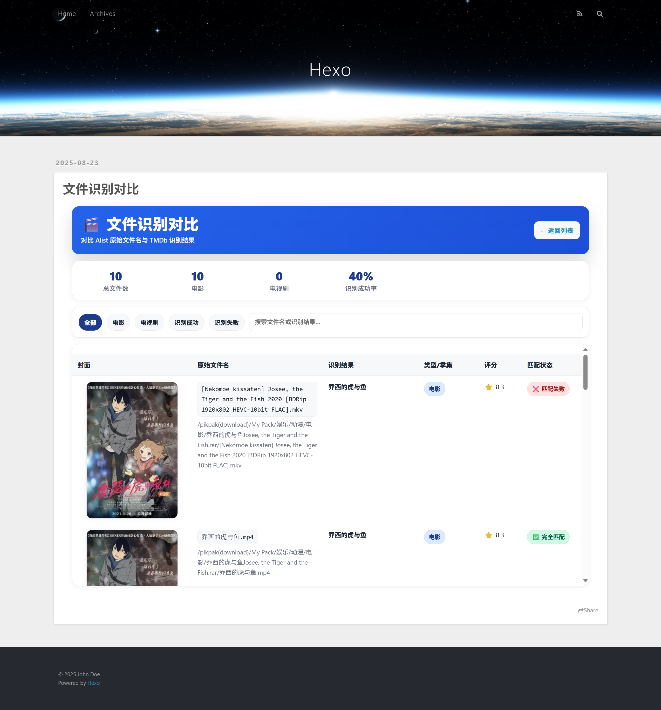

# Hexo Alist Movie 插件

[](https://hansiy.net)
[](https://github.com/imHansiy/hexo-alist-movie-plugin/blob/main/LICENSE)

一个功能强大的 Hexo 插件，它能连接到您的 [Alist](https://alist.nn.ci/) 服务器，通过内置的 **智能识别引擎** 自动扫描和分析影视资源，并结合 [TMDb API](https://www.themoviedb.org/) 为您的网站生成包含丰富元数据、设计精美的电影和电视剧展示页面。

---

### 插图：最终效果展示


---

## ✨ 核心特性

- **🧠 智能识别引擎**：无需手动分类！插件能自动分析混合内容的目录，智能识别电影和电视剧，并从复杂的文件名中提取季号和集数。
- **🎯 TMDb ID 精准匹配**：支持在文件夹或文件名中直接使用 TMDb ID（如 `电影名称 (12345)`），实现 100% 准确的信息匹配。
- **🔄 内容聚合**：自动将同一影视内容的不同版本（如 4K、1080p）或不同形式（如电影版、电视剧版）聚合为单个条目，并在播放页提供版本选择。
- **📚 丰富元数据**：自动获取海报、简介、演员、评分、流派、内容分级、播出状态、制作公司等海量信息。
- **🎨 现代化前端**：
    - 响应式设计的瀑布流列表页，支持按类型、标题、评分、日期等进行 **即时筛选和排序**。
    - 基于 [Plyr.js](https://plyr.io/) 的现代化播放器页面。
    - **文件识别对比工具**，帮助您诊断和优化文件命名。
- **🔌 灵活配置**：支持配置多个 Alist 目录，可分别指定为电影、电视剧或交由智能引擎处理的混合内容。
- **🌐 稳定健壮**：内置 API 请求重试与缓存机制，即使在网络不稳定的情况下也能优雅降级，保证网站生成。

---

## 🚀 快速开始

### 1. 安装插件

在您的 Hexo 博客根目录下执行以下命令：

```bash
npm i hexo-alist-movie-plugin
```

### 2. 配置插件

在您的 Hexo 根目录下的 `_config.yml` 文件中，添加以下配置项并根据您的实际情况修改：

```yaml
# Alist 影视库生成器配置
alist_movie_generator:
  # Alist 服务器信息 (必填)
  alist:
    url: "https://your-alist-url.com"      # 您的 Alist 服务器地址
    username: "your-alist-username"    # Alist 用户名
    password: "your-alist-password"    # Alist 密码

  # TMDb API v3 Auth Token (必填)
  # 您可以从 https://www.themoviedb.org/settings/api 免费申请
  tmdb_token: "your-tmdb-api-v3-auth-token"

  # --- 目录配置 (推荐使用新版分类配置) ---

  # 电影目录：明确指定这些目录下的内容为电影
  movies:
    - path: "/movies/action"
      # title: "动作电影"        # (可选) 自定义此目录的标题
      # detection_config: "strict" # (可选) 使用特定的识别预设 (default, chinese, strict, loose)
    - path: "/movies/comedy"

  # 电视剧目录：明确指定这些目录下的内容为电视剧
  tv_shows:
    - path: "/tv/us"
    - path: "/tv/jp"

  # 混合内容目录 (最强大的功能):
  # 插件将自动分析此目录下的内容，智能区分电影和电视剧
  mixed_content:
    - path: "/mixed_media"

  # 输出配置 (可选)
  output:
    route: "movies"              # 生成页面的路由 (即 yoursite.com/movies/)
    per_page: 24                 # 列表页每页显示的项目数量
    order_by: "rating"           # 默认排序字段 (rating, popularity, date, title)
    order: "desc"                # 默认排序方向 (asc, desc)
```


### 3. 生成页面

像往常一样运行 Hexo 命令：

```bash
hexo clean && hexo generate
```

插件会自动获取数据、生成页面并放置在您的 `public` 目录下。您可以通过 `http://yoursite.com/movies/` (或您自定义的路由) 访问列表页。

---

## 🔧 进阶用法

### 文件命名与目录结构最佳实践

为了获得最高的识别准确率，我们强烈推荐您采用以下目录结构和命名规范。

```
/Alist根目录
├── 电影 (movies)
│   ├── 阿凡达 (2009)
│   │   ├── Avatar.2009.1080p.mkv
│   │   └── poster.jpg
│   ├── 你的名字 (372058)  <-- 最佳实践！使用 TMDb ID
│   │   └── Your.Name.2016.2160p.mkv
│   └── ...
└── 电视剧 (tv_shows)
    ├── 权力的游戏 (Game of Thrones)
    │   ├── Season 01
    │   │   ├── Game.of.Thrones.S01E01.mkv
    │   │   └── Game.of.Thrones.S01E02.mkv
    │   └── Season 02
    │       └── ...
    ├── 间谍过家家 (120089)   <-- 最佳实践！使用 TMDb ID
    │   ├── S01
    │   │   └── ...
    │   └── ...
    └── ...
```

**核心技巧**：
1.  **为每个影视内容创建独立文件夹**。
2.  **在文件夹名称中包含年份**，例如 `电影名称 (2023)`。
3.  **电视剧按季分文件夹**，例如 `Season 01` 或 `S01`。
4.  **【强烈推荐】使用 TMDb ID**：在文件夹或文件名中添加 `(电影ID)` 或 `(电视剧ID)`，插件会优先使用此 ID 进行匹配，准确率 100%！

### 文件识别对比工具

插件会自动生成一个对比页面，帮助您检查识别效果。
访问 `http://yoursite.com/movies/comparison.html` (或您自定义的路由)，您可以看到：
-   原始文件名和路径。
-   插件识别出的影视标题。
-   匹配状态（完全匹配、部分匹配、失败）。

这对于调整和优化您的文件命名非常有帮助。

#### 插图：对比工具截图




## ❓ FAQ

- **TMDb API 连接失败或超时怎么办？**
  - 插件内置了重试机制。请检查您的服务器网络是否能正常访问 `api.themoviedb.org`。如果在中国大陆服务器上运行，可能需要配置代理。

- **有些影片识别不正确怎么办？**
  - 首先，访问**文件识别对比工具**页面，查看具体的匹配情况。
  - 最佳解决方案是使用 **TMDb ID** 命名法，一劳永逸。
  - 其次，优化您的文件夹和文件名，使其更规范。

- **可以自定义播放器页面的样式吗？**
  - 可以。您可以直接修改插件目录 `source/player/style.css` 文件，或者在您的 Hexo 主题中通过 CSS 覆盖其样式。

## 📄 许可证

[ISC](https://github.com/imHansiy/hexo-alist-movie-plugin/blob/main/LICENSE)